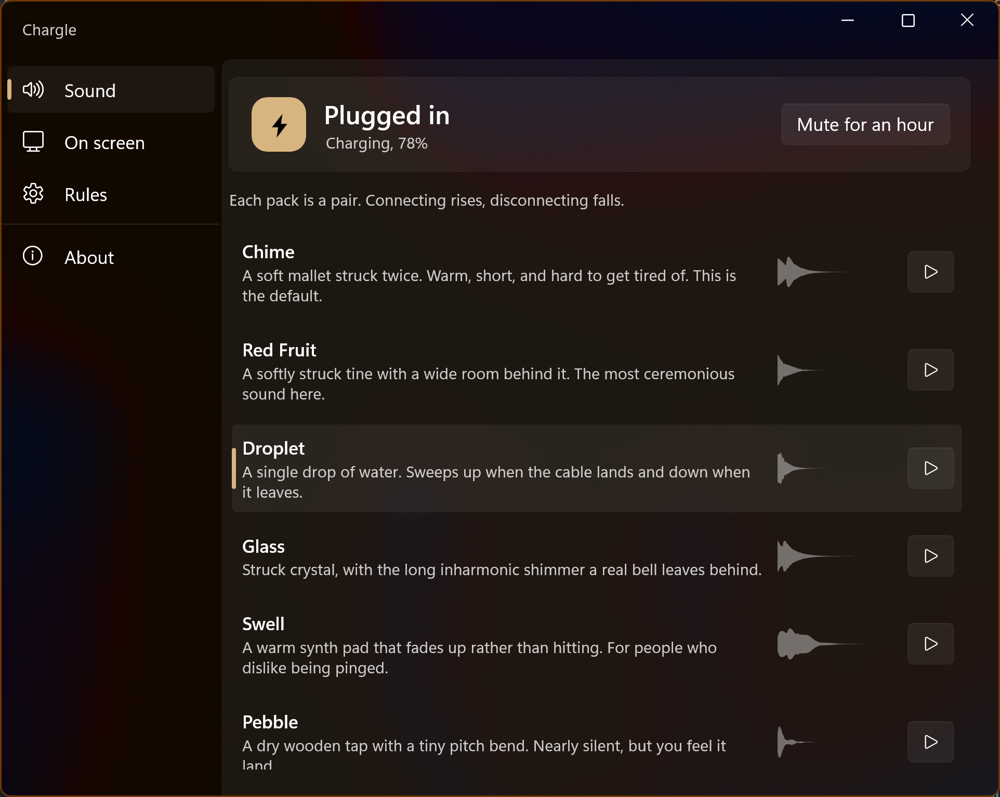

# Chargle

Chargle plays a sound when your laptop starts charging and another when it stops.

There is a site at [arihant25.github.io/Chargle](https://arihant25.github.io/Chargle/) where you can hear every pack and try the on-screen panel before downloading anything.

That is it. Windows still does not have this built in, which is odd once you get used to having it. Chargle sits in the tray, watches the power source, and makes a small noise when the cable goes in or out. If you would rather not hear anything, it can show a little on-screen panel instead.



## What it does

* Comes with eight built-in sound packs
* Can show an optional on-screen indicator in a few different styles and positions
* Can also play sounds for battery full and battery low
* Stays quiet during Do Not Disturb, screen sharing, and full-screen apps
* Lets you use your own audio files if you do not like the built-in ones
* Supports light mode, dark mode, or following the Windows theme
* Does not need an account, phone home, or collect telemetry

## How it works so quickly

The obvious way to build something like this is just a bit too slow. Chargle avoids that in three places.

It listens for `GUID_ACDC_POWER_SOURCE`, which is the power notification Windows updates right when it notices the charger change. If you watch `PBT_APMPOWERSTATUSCHANGE` or keep polling `GetSystemPowerStatus`, you are already working with stale information.

It also avoids waiting on the UI thread. A window-message based listener has to sit in the same queue as everything else the app is doing, which means the sound gets delayed whenever the interface is busy. Chargle uses `DEVICE_NOTIFY_CALLBACK` instead, so the notification arrives on a system thread.

Then there is audio startup. Opening a file, decoding it, and waking the audio device all take time. Chargle decodes sounds ahead of time and can keep a WASAPI stream alive by rendering silence, so playback is ready when the event arrives.

That last bit is optional because it costs a little battery. In the app it is called Instant mode. If you leave it on, the first sound after a quiet stretch is still immediate. If you turn it off, the audio device is released after a few idle seconds and the next sound may take longer.

The app shows the measured time from the power event to the moment the sound is handed to the mixer, so you do not have to take the speed claim on faith.

### Measured

`tools/AudioProbe` is the tool used to check this properly. It plays a sound, records the output back through WASAPI loopback, and measures when audio actually reaches the speakers. These numbers are from six runs on a Realtek device at 48 kHz:

| | median | mean | min | max |
| --- | --- | --- | --- | --- |
| Opening the audio device from cold **(without Instant Mode)** | 555 ms | 656 ms | 468 ms | 1221 ms |
| Play to speakers, stream held open **(Instant Mode)** | 86 ms | 91 ms | 80 ms | 105 ms |
| Play to speakers, endpoint already live | 33 ms | 33 ms | 32 ms | 33 ms |

Opening the device is where most of the delay goes. Instant mode avoids that step. In practice, the first sound after a quiet stretch lands in about 86 ms instead of roughly 590 ms, which is about **7 times sooner** and saves around half a second.

There is still a cost to keeping the stream open. It adds about 54 ms, because WASAPI already has silence queued and that buffer has to drain before the new sound starts. That is why the third row is faster than the second. Compared with a 555 ms cold start, it is still easily worth it, but the trade-off is real.

If you want to run the same benchmark yourself:

```
dotnet run --project tools/AudioProbe -- --benchmark
```

The bottom two rows include a fixed bit of overhead from the loopback capture, so they are most useful when compared against each other rather than treated as absolute speaker latency. The top row is measured without capture running, because loopback itself keeps the endpoint awake and would hide the cold-start cost.

## Sound packs

| Pack | Description |
| --- | --- |
| Chime | Two soft mallet hits. Warm, short, and the default. |
| Red Fruit | A gentle struck tine with a roomy tail. |
| Droplet | A watery sound that rises on plug and falls on unplug. |
| Glass | Bright, glassy, and a little bell-like. |
| Swell | A soft pad that fades in instead of hitting hard. |
| Pebble | A dry wooden tap with a tiny pitch bend. Very restrained. |
| Tick | Barely there. Just a small click. |
| Blip | Three square-wave beeps, like a machine from the late eighties. |

Every pack comes as a pair. Plugging in rises, unplugging falls, so after a day or two you can tell what happened from across the room.

None of the built-in sounds are recordings. They are generated by code in [tools/SoundForge](tools/SoundForge):

```bash
dotnet run --project tools/SoundForge
```

That makes them easy to tweak. Change the synth code, run the tool again, and you can hear the result straight away. The packs are also loudness-matched, so changing sounds does not quietly change the volume profile too.

### Using your own sounds

You can open the sounds folder from inside the app, or add your own pack under `%LOCALAPPDATA%\Chargle\Sounds\`:

```text
%LOCALAPPDATA%\Chargle\Sounds\
    my-pack\
        plug.wav        (or .mp3, .m4a, .flac, .ogg, .wma, .aiff)
        unplug.wav
        pack.json       (optional, for the display name and description)
```

That is the whole format. Restart Chargle and the pack will show up in the list. If you only want to point the app at two files somewhere else, there is an option for that too.

## Installing

There is no Microsoft Store version yet.

For the portable build, download the zip from [Releases](../../releases), extract it anywhere, and run `Chargle.exe`. It is self-contained, so there is nothing else to install first. The trade-off is that the download is fairly large.

To run it from source, install the [.NET 10 SDK](https://dotnet.microsoft.com/download) and use:

```bash
git clone https://github.com/Arihant25/Chargle
cd Chargle
dotnet run --project src/Chargle
```

Visual Studio is not required.

### Building for the Microsoft Store

```powershell
./build/Package.ps1 -Kind store -Rid win-x64
./build/Package.ps1 -Kind store -Rid win-arm64
```

## Project layout

```text
src/Chargle/
    Services/
        PowerMonitor.cs      AC/DC notifications, callback-based rather than window-based
        AudioEngine.cs       warm WASAPI stream and lock-free voice mixer
        CachedSound.cs       one-time decode into 48 kHz float samples
        ChargeWatcher.cs     decides whether an event should trigger playback
        SoundLibrary.cs      loads built-in and user-provided packs
        TrayIconHost.cs      Shell_NotifyIcon handling, including TaskbarCreated
        SystemIntegration.cs startup registration and shell-state checks
    Views/
        MainWindow           settings UI
        IndicatorWindow      click-through overlay panel
    Controls/
        WaveformView.cs      draws the actual waveform for each sound
    Services/
        Presence.cs          decides whether now is a moment to stay quiet
tools/
    SoundForge/              generates the built-in sound packs
    IconForge/               renders the tray icon at each required size
    AudioProbe/              measures playback timing, and reports quiet-hours state
docs/                        the site at arihant25.github.io/Chargle, served by GitHub Pages
    index.html               landing page, with a working plug you can drag
    privacy.html             what the app keeps and what it sends, which is nothing
    assets/                  fonts, styles, and the waveform drawing used on the page
    sounds/                  the eight packs again, so the page can play them
build/
    Package.ps1              portable, sideload MSIX and Store upload builds
```

[tools/AudioProbe](tools/AudioProbe) turned out to be worth keeping around. It uses the real audio path, plays a sound, records the system output back through loopback, and prints levels every 50 ms. It helped catch a bug where the mixer was only clearing part of each buffer and stale audio kept getting replayed as a buzz.

The tray icon is generated with code too. Each size is drawn separately instead of scaling one large image down, which is what keeps the small versions readable.

## Contributing

Issues and pull requests are welcome.

## Licence

[MIT](LICENSE). Use it, change it, ship it. Just keep the copyright notice with it.

The generated icon and sound packs come from code in this repository, so they use the same licence.
